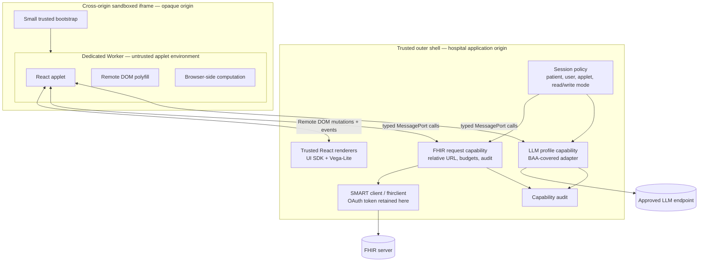

# Spike architecture

## Goals

The spike tests a browser-only runtime that gives an applet:

- ordinary React programming ergonomics;
- broad clinician-scoped FHIR access;
- approved LLM inference;
- rich and performant graphics;
- no raw credentials and no generic outbound network primitive.

It intentionally does **not** enforce resource-specific FHIR profiles. The active SMART grant and the FHIR server remain the principal semantic authorization boundary.

## Components



## Trust boundaries

### Trusted shell

The shell is part of the hospital-approved computing base. It owns:

- SMART launch and token refresh;
- the live `fhirclient` instance;
- LLM provider credentials or a covered same-origin inference adapter;
- protocol validation, quotas, cancellation, and audit;
- all actual DOM nodes and host graphics libraries;
- applet identity, version, and launch context.

Its dependency surface must be kept small, pinned, scanned, and deployed without third-party runtime scripts.

### Sandboxed iframe

The host creates a hidden iframe with:

```html
<iframe
  sandbox="allow-scripts"
  referrerpolicy="no-referrer"
  allow=""
  src="https://sandbox-distinct-domain.example/sandbox.html?..."
></iframe>
```

Omitting `allow-same-origin` gives the iframe an opaque origin. Omitting forms, popups, top navigation, downloads, and storage-access flags keeps those abilities disabled. In production, host and sandbox should be on different registrable domains to encourage browser site/process isolation.

The frame receives one `MessagePort` after a source- and nonce-bound handshake. It creates an inline Blob worker and transfers the port into it. It does not receive clinical data itself.

### Applet worker

The worker contains:

- React 18;
- Remote DOM's minimal DOM polyfill;
- the clinician applet bundle;
- wrappers for the clinical capabilities;
- no real `window` or `document`;
- no token, cookie, or LLM API key.

The worker script is a Blob created by the CSP-constrained iframe. Blob workers inherit the creator's CSP, so `connect-src 'none'` applies to worker `fetch`, WebSocket, EventSource, and related network APIs. The spike confirms this behavior with a direct request to a local `/probe` endpoint that should fail.

## Startup sequence

```mermaid
sequenceDiagram
  participant H as Trusted host
  participant I as Sandboxed iframe
  participant W as Applet worker
  participant B as Clinical broker

  H->>H: Generate 128-bit nonce and MessageChannel
  H->>I: Load sandbox URL containing nonce
  H->>I: postMessage(connect, nonce, port2)
  I->>I: Verify parent source and nonce
  I->>W: Create inline worker; transfer port2
  W->>H: RPC connect(protocol, applet ID, version)
  H->>H: Verify protocol and exact applet identity
  H-->>W: Remote DOM connection, clinical API, context
  W->>W: Probe DOM, network, and storage
  W->>B: audit(security probe)
  W->>B: fhirRequest(Patient/...)
  B->>B: Validate relative destination and budget
  B-->>W: Synthetic FHIR result in the spike
  W->>H: Remote DOM mutations
  H->>H: Render trusted React components and Vega
```

## Message protocol

`@quilted/threads` is used because it can proxy nested callable objects and event functions over a `MessagePort`, which fits Remote DOM. The public interface is defined in `src/shared/protocol.ts`.

The applet receives:

```ts
interface ClinicalCapabilityApi {
  fhirRequest(request: {
    url: string;
    init?: {
      method?: 'GET' | 'POST' | 'PUT' | 'PATCH' | 'DELETE';
      headers?: Record<string, string>;
      body?: unknown;
    };
  }): Promise<unknown>;

  llmComplete(request: {
    profile: string;
    messages: Array<{
      role: 'system' | 'user' | 'assistant';
      content: string;
    }>;
    responseSchema?: Record<string, unknown>;
  }): Promise<{
    text: string;
    model: string;
    profile: string;
    usage: {inputTokens: number; outputTokens: number};
  }>;

  audit(event: {
    kind: 'lifecycle' | 'security-probe' | 'application';
    message: string;
    detail?: Record<string, unknown>;
  }): Promise<void>;
}
```

Zod validates every capability call in the trusted shell. A production implementation should additionally impose message byte limits before deserialization, per-session call budgets, bounded concurrency, and abort/cancellation identifiers.

## Broad FHIR authority

`FhirRequestCapability` deliberately avoids a FHIR resource allowlist. It accepts any relative request inside the active SMART server base path. This permits applications to use arbitrary searches, operations, paging, and resource types allowed by the EHR.

The broker still provides meaningful containment:

1. The applet cannot obtain the bearer token.
2. Absolute and scheme-relative URLs are rejected.
3. Base-path traversal is rejected.
4. Caller-provided authorization, cookie, host, origin, referrer, and proxy-authorization headers are stripped.
5. The response is bounded by size and time.
6. Audit records contain operation metadata, not returned PHI.
7. Read/write mode is a product policy independent of the applet bundle.

In production, `src/host/broker/smart-fhirclient-adapter.ts` replaces the synthetic transport. `fhirclient` performs authenticated requests and automatic access-token refresh in the trusted shell.

## UI transport

The applet uses React normally, but its JSX elements are Remote DOM custom elements. React reconciles a virtual tree against Remote DOM's worker polyfill. Remote DOM then sends mutation records to the host, where `RemoteReceiver` maps each permitted element to a trusted React component.

This gives the host final control over:

- element types;
- property normalization and size limits;
- event payloads;
- styles and URLs;
- accessibility behavior;
- graphics loaders and export actions;
- portal surfaces such as dialogs and menus.

It also means DOM-dependent React packages are not automatically compatible. The SDK should provide high-value adapters and escape hatches such as safe canvas surfaces rather than exposing unrestricted HTML.

## Vega-Lite path

The applet sends an inline Vega or Vega-Lite specification as a property of `ui-vega`. The trusted host:

- clones and recursively checks the specification;
- rejects `url`, `href`, `src`, image, loader, and base-URL keys;
- rejects executable or external URL schemes embedded in strings;
- enforces a 1.5 MB specification budget and array limits;
- invokes `vegaEmbed` with `actions: false` and a canvas renderer;
- disposes the prior Vega view before re-rendering.

This preserves Vega's rich declarative grammar and interactive signals without allowing the specification to fetch external data or open the editor/export UI.

## Two-origin development server

`tools/serve.mjs` is intentionally tiny and uses only Node's standard library. It serves already-built assets and applies different headers to host and sandbox origins.

This server is not part of clinical computation. A production deployment would put the two static bundles behind hardened hospital-controlled origins and headers, usually with an outbound proxy or browser policy that can independently confirm the sandbox has no Internet route.

## Production variant

```text
EHR launch page
  └─ Trusted shell at apps.hospital.example
       ├─ SMART public client
       ├─ same-origin clinical gateway only if required by EHR CORS
       ├─ BAA-covered model gateway
       └─ sandbox iframe at hospital-applet-sandbox.net
            └─ worker with applet bundle
```

A same-origin gateway may be operationally necessary where an EHR or model provider cannot be called directly from the browser. That gateway performs network transport but must never execute applet code. The architectural requirement is **browser-only applet computation**, not necessarily direct browser connectivity to every protected API.
