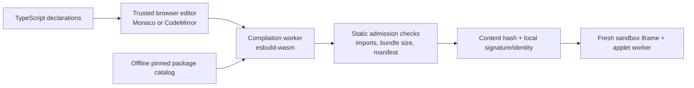

# In-browser authoring plan

The included spike uses Vite as local build tooling, but the production concept can compile clinician-authored TypeScript/React **entirely inside the browser**.

## Recommended architecture



No applet source or executable bundle needs to be sent to a server for execution.

## `esbuild-wasm`

The official esbuild API supports WebAssembly execution in a browser Web Worker. It is a good fit for fast TSX feedback and bundling.

The compiler should use a virtual filesystem and a custom resolver. It should never resolve a missing import by contacting npm or a CDN. Packages are supplied as immutable, locally hosted assets selected by the platform.

Example conceptual resolver policy:

```ts
const allowedPackages = new Map([
  ['react', '/catalog/react/18.3.1/index.js'],
  ['@clinical-applet/sdk', '/catalog/sdk/1.0.0/index.js'],
  ['d3-scale', '/catalog/d3-scale/pinned/index.js'],
  ['d3-shape', '/catalog/d3-shape/pinned/index.js'],
]);

function resolve(specifier: string) {
  if (/^(https?:|data:|blob:|file:)/i.test(specifier)) {
    throw new Error('URL imports are disabled');
  }
  const resolved = allowedPackages.get(specifier);
  if (!resolved) throw new Error(`Package is not in the applet catalog: ${specifier}`);
  return resolved;
}
```

The catalog can be broad, but it should be intentional and tested in the worker/Remote DOM environment.

## Developer experience

A first-class editor should provide:

- TypeScript diagnostics and completion for the clinical and UI APIs;
- a synthetic-patient preview;
- hot reload by terminating and replacing the applet worker;
- console output captured as bounded structured events;
- network/storage capability inspector;
- FHIR request trace showing paths, timing, and result counts without dumping PHI by default;
- component explorer and examples;
- unit tests running in another worker;
- deterministic formatter;
- a manifest editor for requested modes, model profiles, and write behavior;
- “publish” that produces a content-addressed sealed bundle.

Monaco offers VS Code-like TypeScript support; CodeMirror 6 is smaller and easier to constrain. Either is suitable because the editor is trusted shell code, not applet code.

## Applet package model

Suggested source layout:

```text
applet/
  applet.manifest.json
  src/App.tsx
  src/fhir.ts
  src/charts.ts
  tests/app.test.ts
```

Suggested manifest:

```json
{
  "id": "org.example.growth-explorer",
  "version": "0.2.0",
  "runtime": "remote-dom-react-v1",
  "fhirAuthority": "active-smart-grant",
  "writeMode": "read-only",
  "llmProfiles": ["longitudinal-note-analysis-v4"],
  "uiSdk": "1.0.0",
  "packages": {
    "d3-scale": "pinned",
    "d3-shape": "pinned"
  }
}
```

`fhirAuthority: active-smart-grant` is broad by design. Institutions can override it with a patient-compartment or resource-specific policy without changing source.

## Loading the compiled bundle

Two browser-only patterns are plausible:

### Fresh worker bundle

The compiler creates one self-contained worker module containing React, the Remote DOM bindings, SDK, and applet. The sandbox creates the worker from a Blob URL. This is simple and gives each reload a fresh realm.

### Fixed harness plus app module

A pinned worker harness receives the compiled app module as bytes and loads it from a Blob module URL. This reduces rebuild size and keeps connection logic fixed. The harness must ensure the module cannot import URLs or escape the allowed module graph.

The fresh-bundle approach is easier to reason about initially. The fixed-harness approach is more efficient once the protocol is stable.

## Static checks

Browser-side compilation is not a security boundary, but it can improve quality and governance. Check:

- no URL or dynamic remote imports;
- no undeclared packages;
- no direct use of forbidden globals where detectable;
- no source maps containing PHI or secrets;
- maximum source, bundle, module, and dependency sizes;
- exact SDK/runtime compatibility;
- manifest identity and version;
- lint rules for unbounded loops and dangerous regex where practical;
- unit tests and synthetic-data preview;
- output hash.

Runtime controls remain necessary because JavaScript is dynamic and static checks can be bypassed.

## Package catalog strategy

Do not attempt to make all npm packages available on day one. Start with:

- React/Preact and the clinical SDK;
- date/time and formatting libraries;
- pure D3 modules;
- statistics, arrays, and linear algebra libraries that work in workers;
- FHIR utility types and FHIRPath implementation after review;
- safe regex/Wasm helper;
- test framework subset.

Add packages based on real app requests. Each catalog release is immutable and can be tested against the security and performance suite.

## Publishing and provenance

A published applet artifact should bind:

- exact source tree hash;
- compiled bundle hash;
- manifest;
- compiler/runtime/catalog versions;
- author identity and organization;
- test results;
- admission decision;
- optional reviewer signatures.

The shell launches an exact hash and records it in the audit. Updates create a new immutable version.
